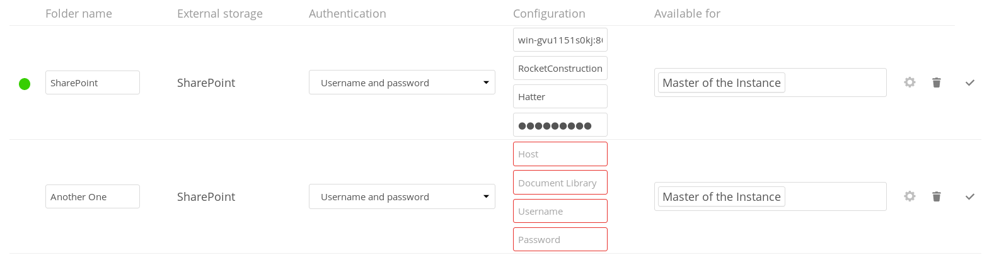

<!--
  - SPDX-FileCopyrightText: 2017 Nextcloud GmbH and Nextcloud contributors
  - SPDX-License-Identifier: AGPL-3.0-or-later
-->
# SharePoint

💾 Nextcloud SharePoint Backend for External storages

The SharePoint Backend allows administrators to add SharePoint document libraries as folders in Nextcloud. This offers an easy way for users to access SharePoint data in the same place where they find their other files, facilitating collaboration and sharing within and across the borders of the organization. Users can use the desktop client, mobile apps or web interface and comment, tag, share and collaboratively edit files on SharePoint just like with any other data on Nextcloud.

Supports SharePoint 2013, 2016, 2019 (experimental) and SharePoint Online (Office 365). Nextcloud accesses SharePoint through the SharePoint REST API and uses SAML Token authentication, with a fallback to NTLM auth. Nextcloud respects file access permissions associated with its configured user credentials. Versioning and sharing are handled by Nextcloud.

# How To Add Office 365 Onedrive
  Make sure you have enabled [External storage support](https://docs.nextcloud.com/server/24/go.php?to=admin-external-storage) and the Sharepoint app. Then go to Administration 
  Settings and select External Storage and add Sharepoint as follow:
  First, you need to get your remote's URL:

Go [here](https://onedrive.live.com/about/en-us/signin/) to open your OneDrive or to sign in
Now take a look at your address bar, the URL should look like this: https://[YOUR-DOMAIN]-my.sharepoint.com/personal/[YOUR-EMAIL]/_layouts/15/onedrive.aspx
You'll only need this URL up to the email address as "Host". After that, you'll most likely want to add "Documents" as "Document Library". That subdirectory contains the actual data stored on your OneDrive. Then enter your email as "Username" and password and you are good to go. Credit goes to [rclone](https://rclone.org/webdav/#sharepoint-online).

Learn more about External Storage and SharePoint on [https://nextcloud.com/storage/](https://nextcloud.com/storage/)
